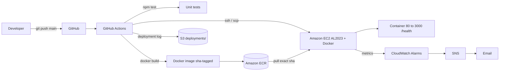

# Automated AWS Deployment Pipeline

Containerized Node.js API that is **automatically deployed to AWS EC2** on
every push to `main` — with tests, SHA-tagged images, health verification,
automatic rollback, S3 deployment logs, and CloudWatch/SNS alerting.

Every feature in this README is backed by a real file and a working command.
Implemented features are clearly separated from future work in
["What is NOT implemented"](#what-is-not-implemented-honest-status).

---

## Overview

| | |
| --- | --- |
| **Application** | Express.js API (`/`, `/health`, `/ready`) |
| **Registry** | Amazon ECR, images tagged with the Git commit SHA |
| **Compute** | Single Amazon Linux 2023 EC2 instance running Docker |
| **CI/CD** | GitHub Actions → tests → build → push → SSH deploy → verify |
| **IaC** | Terraform (full stack in `infra/terraform/`) |
| **Monitoring** | CloudWatch alarms (CPU + status checks) → SNS email |
| **Deployment logs** | `s3://<bucket>/deployments/<date>/<commit-sha>.log` |

## Problem Statement

Deploying a backend to AWS is usually a manual chore: SSH in, pull code,
restart the server, hope it's healthy, and repeat — with no trace of what
changed or who deployed it. This project turns that ritual into a push
button: `git push` → automated test gate → versioned image → deployed
container → verified health → auditable log, with alarms watching the host.

## Objectives

1. Deploy a containerized app to EC2 automatically from GitHub, with no
   manual steps and no fake steps.
2. Fail loudly: broken tests or a failed health check must fail the
   workflow — never ship a broken build silently.
3. Know exactly what is running: the deployed image is tagged by commit
   SHA and the app reports that SHA on `/`.
4. Recover: automatic rollback to the previous version when the new one is
   unhealthy.
5. Observe and audit: S3 deployment logs, CloudWatch alarms, SNS email.
6. Keep everything reproducible and affordable (no NAT Gateway, Free
   Tier-sized instance, cleanable in one command).

## Architecture

```
Developer
|
| git push (main)
v
GitHub
|
v
GitHub Actions  (.github/workflows/deploy.yml)
|
+--> npm ci + vitest tests          (8 tests - fail stops pipeline)
|
+--> docker build  (APP_VERSION=<commit sha>)
|
+--> docker push  ---->  Amazon ECR (aws-deployment-demo:<sha>, :latest)
|
+--> ssh + scp  ------------------------->  Amazon EC2 (AL2023 + Docker)
                                              |
                                              +--> ./deploy.sh <sha>
                                              |     pull exact image
                                              |     stop/remove old container
                                              |     run new container (80->3000)
                                              |     poll /health
                                              |     rollback on failure
                                              |
                                              +--> logs: docker logs
v
Health check + version check (from CI, via public port 80)
|
v
Deployment log ---->  S3 (deployments/<date>/<sha>.log)

Monitoring path:
EC2 (AWS/EC2 metrics)
|
v
CloudWatch alarms (CPUUtilization > 70% 2x5min, StatusCheckFailed)
|
v
SNS (aws-deployment-alerts)
|
v
Email
```

<details>
<summary>Mermaid diagram</summary>



</details>

## Tech Stack

- **App**: Node.js 24 (LTS), Express 5, ESM
- **Tests**: Vitest + supertest
- **Containers**: Docker, multi-stage build, non-root, Docker HEALTHCHECK
- **CI/CD**: GitHub Actions (OIDC federation to AWS — no stored AWS keys)
- **AWS**: VPC, Internet Gateway, public subnet, route table, security
  group, EC2 (AL2023), IAM roles, ECR, S3, SNS, CloudWatch
- **IaC**: Terraform (AWS provider ~> 5.0)

## Repository Structure

```
aws-deployment-pipeline/
├── .github/
│   └── workflows/
│       └── deploy.yml              # CI/CD: tests -> ECR -> EC2 deploy -> S3 log
├── app/
│   ├── src/
│   │   ├── app.js                  # Express app (factory for testability)
│   │   └── server.js               # Boot + graceful shutdown (SIGTERM/SIGINT)
│   ├── tests/
│   │   └── app.test.js             # Vitest suite: /, /health, /ready, 404, config
│   ├── package.json
│   └── package-lock.json
├── docker/
│   └── Dockerfile                  # Multi-stage, non-root, HEALTHCHECK
├── scripts/
│   ├── deploy.sh                   # Runs on EC2: pull, replace, health check, rollback
│   ├── health-check.sh             # Retry loop on /health
│   ├── rollback.sh                 # Manual rollback to previous image
│   └── ec2-user-data.sh            # EC2 first-boot setup (Docker, dirs)
├── infra/terraform/                # Full AWS stack as code (see Terraform section)
├── docs/
│   ├── architecture.png            # Architecture diagram
│   ├── deployment-flow.md          # Step-by-step pipeline narrative
│   ├── security.md                 # Security review
│   ├── troubleshooting.md          # Errors -> causes -> fixes
│   ├── aws-setup.md                # Manual CLI path (no Terraform)
│   └── interview-guide.md          # Q&A + 60-second summary
├── screenshots/                    # Add demo screenshots here
├── tools/
│   └── generate-architecture.ps1   # Regenerates docs/architecture.png
├── .dockerignore
├── .gitignore
├── .env.example
├── docker-compose.yml
├── README.md
├── COST.md                         # Costs + cleanup economics
└── LICENSE
```

## Local Setup

### Local Node.js development

```bash
cd app
npm ci
npm start           # -> server listening on :3000
curl http://localhost:3000/
curl http://localhost:3000/health
curl http://localhost:3000/ready
```

`npm run dev` runs with `node --watch` (auto-restart on change).

### Tests

```bash
cd app
npm test            # vitest run — 8 tests, must be green before any deploy
```

### Stopping

`Ctrl+C` for `npm start`/`npm run dev`.

## Docker Setup

```bash
# build (from repository root — the compose file uses this too)
docker build -f docker/Dockerfile --build-arg APP_VERSION=local -t aws-deployment-demo:local .

# run
docker run -d --name aws-deployment-demo -p 3000:3000 --restart unless-stopped aws-deployment-demo:local

# inspect
docker ps                          # status + (health: starting/healthy)
docker logs -f aws-deployment-demo

# stop
docker stop aws-deployment-demo && docker rm aws-deployment-demo
```

### Docker Compose (local one-liner)

```bash
docker compose up --build      # builds + runs on :3000, restart: unless-stopped
docker compose down            # stop + remove
docker compose logs -f app     # stream app logs
```

Note on Docker security: the container runs as user `node` (non-root), and
`.dockerignore` excludes secrets, tests, git metadata, and infrastructure
files from the build context.

## AWS Architecture

One of each (intentionally minimal, no NAT Gateway, no Load Balancer):

| Resource | Name | Purpose |
| --- | --- | --- |
| VPC `10.0.0.0/16` | `aws-deployment-demo-vpc` | Isolated network |
| Public subnet `10.0.1.0/24` | `aws-deployment-demo-public-subnet` | Hosts EC2, public IPs on launch |
| Internet Gateway | `aws-deployment-demo-igw` | Internet path for the subnet |
| Route table (route `0.0.0.0/0` → IGW) | `aws-deployment-demo-route-table` | **This route is what makes the subnet public** |
| Security group | `aws-deployment-demo-sg` | Ingress: TCP 80 (any), TCP 22 (admin IP only); egress: all |
| EC2 (t3.micro / Free-Tier type) | `aws-deployment-demo-ec2` | AL2023, Docker daemon, instance role |
| ECR repo | `aws-deployment-demo` | Image registry, scan on push |
| S3 bucket | `aws-deployment-demo-deploy-logs-<account>` | Deployment logs (`deployments/`), private |
| SNS topic | `aws-deployment-alerts` | Alarm notifications, email subscription |
| CloudWatch alarms | CPU + status check | Publish to SNS |

Traffic path: **Internet → port 80 → Docker mapping → Node on 3000**.
Port 3000 is never exposed publicly; there is no HTTPS — HTTP only (see
honest status below).

## IAM Design

**Instance role** (`aws-deployment-demo-ec2-role`, attached to EC2):
- `ecr:GetAuthorizationToken` (on `*` — AWS requires this)
- `ecr:BatchCheckLayerAvailability`, `ecr:BatchGetImage`,
  `ecr:GetDownloadUrlForLayer` — scoped to the single ECR repo ARN
- Nothing else. No S3 (CI uploads logs), no CloudWatch (agentless metrics),
  no AdministratorAccess.

**GitHub deploy role** (`aws-deployment-demo-github-deploy-role`, assumed via
GitHub OIDC by pushes to `main` of one repository):
- ECR push + pull (scoped to the repo ARN, plus token auth on `*`)
- `s3:PutObject` on `deployments/*` only

**Why instance roles beat static keys**: temporary credentials supplied by
the EC2 instance metadata service (IMDSv2 enforced), automatically rotated,
never stored on disk, never committed, instantly revocable by deleting the
role. Static access keys on a host are the classic leak vector — they sit in
plaintext files, survive backups, and get copied into logs and screenshots.

## CI/CD Pipeline

`.github/workflows/deploy.yml` — triggers on push to `main` (plus manual
dispatch). `concurrency` queues runs so two deploys never race the same host.

**Job `test`** — Node 24, `npm ci`, `npm test`. Red tests stop everything
here (`needs` on the deploy job).

**Job `deploy`** (runs only after tests pass):
1. Derive account ID + ECR registry from the OIDC role ARN
2. Assume the deploy role via OIDC (`id-token: write`)
3. ECR login → `docker build --build-arg APP_VERSION=<sha>` → tags
   `:<full-sha>` + `:latest` → push both
4. SSH: grant the runner's own IP a temporary port-22 rule
   (`AuthorizeSecurityGroupIngress`), `scp` the deploy scripts up, run
   `ssh ./deploy.sh <sha>`, then revoke the rule (`if: always()`) — port 22
   is open ~60 seconds per deploy, to one runner IP at a time
5. `deploy.sh` pulls the exact image, swaps the container, health checks
   locally, auto-rolls back on failure, exits non-zero on failure
6. CI curls the **public** `/health` and asserts the served `version`
   equals the commit SHA (external, real-internet verification)
7. Deployment log (status, sha, image, host, health result, run URL) is
   uploaded to S3 with `if: always()` — failed deploys are logged too

### GitHub secrets required

| Secret | Example value | Source |
| --- | --- | --- |
| `AWS_REGION` | `ap-south-1` | Your chosen region |
| `AWS_ROLE_ARN` | `arn:aws:iam::123456789012:role/aws-deployment-demo-github-deploy-role` | Terraform output `github_deploy_role_arn` |
| `EC2_HOST` | `54.219.x.x` | Terraform output `ec2_public_ip` |
| `EC2_USER` | `ec2-user` | Amazon Linux default |
| `EC2_SSH_PRIVATE_KEY` | (contents of your private key file) | The key you imported |
| `ECR_REPOSITORY` | `aws-deployment-demo` | Repo name |
| `S3_BUCKET` | `aws-deployment-demo-deploy-logs-<account>` | Terraform output `deploy_log_bucket` |

OIDC trust policy (in `infra/terraform/iam-github-oidc.tf`) is scoped to
`repo:<owner>/<repo>:ref:refs/heads/main` — set `github_repo` accordingly.

## Deployment Process

1. Terraform (or the manual path in `docs/aws-setup.md`) creates the AWS
   stack; EC2 user-data installs Docker and prepares `~/app/`.
2. You add the seven GitHub secrets above.
3. Push to `main`. The workflow runs tests, builds, pushes, SSH-deploys,
   health-checks, uploads the S3 log.
4. Verify: `curl http://<ec2-ip>/` — `version` equals your commit's SHA.
5. Want to trigger a deploy without a new commit? Actions tab → the
   workflow → *Run workflow* (from `main`).

## Rollback

**Automatic (during deploy):** if the new container fails its health check,
`deploy.sh` logs the container's output, removes it, starts the previously
deployed image, and re-verifies health. The workflow still fails (exit 1)
— a failed deploy is a failed deploy, even after a successful rollback —
but the previous version keeps serving.

**Manual:** SSH in and run `~/app/rollback.sh` (uses the same state files,
swaps current/previous so repeated calls toggle between versions).

**Honest characterization:** single-host rollback to a known-good image.
Not blue-green, not zero-downtime — the old container is stopped before the
new one starts (a seconds-long gap is possible).

## Monitoring

| Alarm | Metric | Threshold | Evaluation | Action |
| --- | --- | --- | --- | --- |
| `aws-deployment-demo-cpu-high` | `AWS/EC2 CPUUtilization` (Average) | > 70% | 2 × 300s | SNS email (ALARM + OK) |
| `aws-deployment-demo-instance-status-check` | `AWS/EC2 StatusCheckFailed` (Maximum) | ≥ 1 | 2 × 60s | SNS email (ALARM + OK) |

**Testing the alarm (reproducible — this intentionally loads the CPU):**

```bash
ssh -i ~/.ssh/aws-deployment-demo ec2-user@<ec2-ip>

# Controlled load: 1 core at ~100% for 15 minutes (400s x 3 waves).
# This deliberately increases CPUUtilization — that is the whole point.
timeout 900 bash -c 'while :; do :; done' &      # simple busy loop, stop with: kill %1

# Alternative using stress if you install it:
# sudo dnf install -y stress && stress --cpu 1 --timeout 900
```

Then watch: CloudWatch → Alarms → `aws-deployment-demo-cpu-high`. Standard
metrics arrive every 5 minutes, so expect **~10–15 minutes** until ALARM,
and an SNS email. Kill the loop and the alarm returns to OK with another
email. Full detail: `docs/troubleshooting.md` and README §Cost Control.

SNS email requires the **confirmed** subscription (click the link AWS
emails you when the subscription is created; until then, delivery is
silently skipped). Check `aws sns list-subscriptions-by-topic` for
`PendingConfirmation`.

## Logging

| Log | Where |
| --- | --- |
| Application logs | `docker logs aws-deployment-demo` on EC2 |
| Deployment logs | `s3://<bucket>/deployments/<date>/<sha>.log` |
| Pipeline logs | GitHub Actions run page |

No secrets are printed anywhere: scripts emit image tags, statuses, and
public health output only.

## Security

Full review in `docs/security.md`. Highlights: OIDC + instance roles (no
stored keys), SSH restricted to admin IP, only port 80 public, non-root
container, minimal S3 bucket (public-block on, encrypted, ACLs off), IMDSv2,
ECR scan-on-push, no AdministratorAccess, error responses return generic
messages (no stack traces), only whitelisted info (name/env/version/time)
is exposed on `/`.

## Terraform

```bash
cd infra/terraform
cp terraform.tfvars.example terraform.tfvars   # then edit: your IP, email, repo, key
terraform init
terraform validate
terraform fmt
terraform plan                                  # review!
terraform apply
terraform output                                # EC2 IP, role ARN, bucket...
```

State is local and git-ignored (`.terraform/`, `*.tfstate*` in
`.gitignore`). Prefer the manual path? `docs/aws-setup.md` provisions the
identical stack with plain AWS CLI commands.

## What is NOT implemented (honest status)

- **HTTPS/TLS** — HTTP only. (Future: ACM + ALB + Route 53.)
- **Zero-downtime / blue-green / canary** — none. One host, one container,
  replaced in place with a seconds-long potential gap. The wording used in
  this README and the interview guide is "automated container deployment
  with health verification and rollback".
- **NAT Gateway / private subnet** — deliberately omitted (cost). Public
  subnet only.
- **CloudWatch agent / custom app metrics** — only built-in EC2 metrics.
- **ALB / Auto Scaling** — single instance.
- **Container orchestration (ECS/Kubernetes)** — none. Plain Docker.
- **Automated Terraform validation in CI** — `terraform init/validate/plan`
  are documented commands you run locally; the pipeline does not run them.

## Testing

```bash
cd app
npm ci
npm test          # 8 tests: /, /health, /ready, 404s, startup/config behavior
```

CI runs the same suite before every deploy; a failing test aborts
deployment. Test the whole flow locally before wiring AWS:

```bash
docker compose up --build        # app on :3000
curl http://localhost:3000/health
docker compose down
```

## Troubleshooting

`docs/troubleshooting.md` covers: OIDC assume-role errors, ECR login
failures, SSH timeouts (SG IP drift), health check failures (with log
commands), S3 upload denial, alarm timing (5-minute metric granularity),
unconfirmed SNS subscriptions, and Terraform gotchas.

## Cost Control

See `COST.md` for the full breakdown. Key points:

- **t3.micro** (or t2.micro) — Free Tier eligible when available
- **No NAT Gateway** — saves ~$32+/month
- **ECR + S3** — trivial at this scale; S3 logs expire after 90 days
- **CloudWatch** — basic metrics/alarms cost pennies
- The instance keeps running (and billing) until you stop/terminate it —
  see Cleanup and the e-stop command below.

## Cleanup

```bash
cd infra/terraform
terraform destroy          # removes the whole AWS stack

# or the manual path:
aws ec2 terminate-instances --instance-ids <id>
# then delete: ECR repo images, S3 bucket objects, SNS topic, alarms, IAM roles
# (all listed in COST.md)
```

Stop (keep instance, stop billing the compute):

```bash
aws ec2 stop-instances --instance-ids <id>
```

## Interview Walkthrough

The live demo, in order (15–20 min, every step works):

1. Open the app: `curl http://<ec2-ip>/` — note the `version` field
2. Make a small change (e.g. bump a message), commit
3. `git push origin main`
4. GitHub → Actions: watch the run — tests pass, image builds, pushes
5. ECR console: show the image tagged with the new SHA
6. Show the SSH deploy step succeeding, health check passing
7. Re-curl the app: `version` is the new commit
8. S3 console: `deployments/<today>/<sha>.log` — open it (status, health)
9. CloudWatch console: the two alarms, current states
10. Trigger the CPU test (command above), talk through what will happen:
    metrics → 2 evaluation periods → ALARM → SNS email (~10–15 min)
11. Show the ALARM state flip and the email (or the recorded screenshots)
12. Explain rollback: state files, deploy.sh logic, `rollback.sh`; to demo a
    failed deploy live, push a commit that breaks the image (e.g. point the
    Dockerfile CMD at a wrong port) — the workflow goes red, deploy.sh rolls
    back automatically, and the old version keeps serving; revert the commit.

Narrate from `docs/deployment-flow.md`; Q&A prep from
`docs/interview-guide.md`.

## Future Improvements

Realistic next steps (not implemented — kept honest):

- ALB + Auto Scaling Group → real zero-downtime blue-green
- HTTPS via ACM certificate (+ Route 53 DNS)
- AWS Systems Manager replacing SSH deploys (no inbound 22 at all)
- Staging environment + manual approval gate before production
- Centralized logging (CloudWatch Logs agent), CloudWatch dashboard
- ECS/Fargate migration; Kubernetes/EKS only as an eventual direction
- Terraform: remote state, modules, multiple environments
- Container image signing, automated dependency scanning gates
